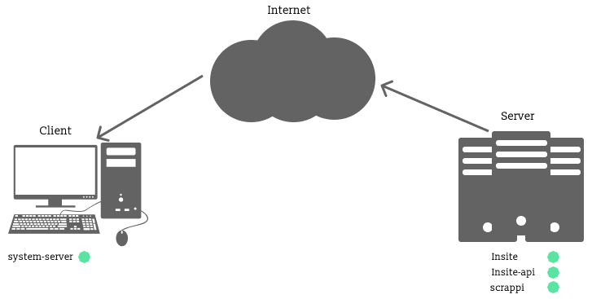

# insite-api

> Graphql API for tracking and normalizing time-series data.

## The Problem

We have a systems that need to be monitored in real time and we need to be able to view and track very granular data on each system over time, while at the same time be able to view all this data in a concise and infomative way.

To summarise, data from various systems should be stored according to the time that they were collected.

From this understanding the problem can be broken down into smaller sections and addressed as follows:

- There needs an application that serves consistent data across machines and architectures.
- The data has to be in a format that is widely recognised and easily transported across a network
- The data has to be sent in a consistent and reliable manner according to a timed interval indefinitely.
- There needs to be an application that can present all data collected in a consise and informative manner.
- There needs to be an application to store and normalize all data collected.

## The Ecosystem

To address the problems at hand, several libraries have already been created respectively.

- [scrappi](https://github.com/Pr0x1m4/scrappi), a versatile web scraping utility designed with collecting time series data in mind.
- [system-server](https://github.com/Pr0x1m4/system-server), a small application that serves system data as JSON, over HTTP.
- [insite](https://github.com/PalisadoesFoundation), a frontend for viewing data collected from `insite-api`.
- [insite-api](https://github.com/PalisadoesFoundation/insite-api), a GraphQL server designed for storing and normalizing time-series data.

## Data Flow

Now that would've described the problem and listed their respective solutions, the actual flow of data through out the entire architecture can be described.

### Operation

Firstly, given that the <b>client</b> has `system-server` installed and running, data can be collected on a specified port (specified by the developer), as well as `scrappi`, `insite-api` and `insite` (optional) running on the <b>server</b> (or another machine), then `scrappi` scrapes the port running `system-server` to get the specific data on the machine, after collecting the data `scrappi` then does a HTTP POST to `insite-api`. At this point the data has been collected and stored in `insite-api` and can then be served on request. `scrappi` proceeds to do this indefinitely at a timed interval set by the developer.

### Further Reading

> [scrappi](https://github.com/Pr0x1m4/scrappi) [system-server](https://github.com/Pr0x1m4/system-server) [insite](https://github.com/PalisadoesFoundation) [insite-api](https://github.com/PalisadoesFoundation/insite-api)
